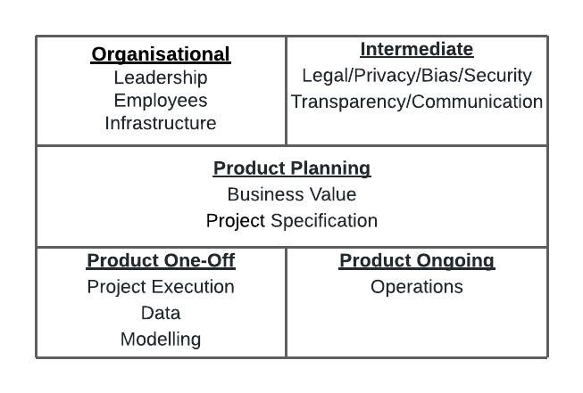

# datascience-fails
Collection of articles listing reasons why data science projects fail.

If you have an article that should be added, please suggest it with its link in the [Issues](https://github.com/xLaszlo/datascience-fails/issues).

I summarised my findings on my blog: [Data Science Risk Categorisation](https://laszlo.substack.com/p/data-science-risk-categorisation)

I added the post to my new company's ([hypergolic.co.uk](https://hypergolic.co.uk/)) blog as well at : [Data Science Risk Categorisation](https://hypergolic.co.uk/blog/data-science-risk/)

Follow me at [@xLaszlo](https://twitter.com/xLaszlo) on Twitter for updates.
  

**Categorisation**
- Organisational
    - Leadership
    - Employees
    - Infrastructure
- Intermediate
    - Legal/Privacy/Bias/Security
    - Transparency/Communication
- Product Planning
    - Business Value
    - Specification
- Product One-Off
    - Project Execution
    - Data
    - Modelling
- Product Ongoing
    - Operations
    
After looking through the 300+ failures listed below there is a notable absence of any concern about _domain_ experts and any collaboration with them apart from off-hand mentions regarding labelled data. The reader should take this into account when using the above categorisation. (Laszlo)
  

I created this image on how I imagine communicating this on a single slide (excuse my design skills, it's a 2x3 table in lucidcharts with the middle row merged).
 

  

**Why 87% of Machine learning Projects Fail** [(link)](https://hackernoon.com/why-87percent-of-machine-learning-projects-fail-sp343uhj)
- Not Enough Expertise
- Disconnect Between Data Science and Traditional Software Development
- Volume and Quality of Data
- Labeling of data
- Organizations are Siloed
- Lack of collaboration
- Technically Infeasible Projects
- Alignment Problem Between Technical and Business Teams
- Lack of Data Strategy
- Lack of Leadership support
  

**Top 10 Challenges to Practicing Data Science at Work** [(link)](https://businessoverbroadway.com/2018/03/18/top-10-challenges-to-practicing-data-science-at-work/)
- Based on doing PCA on the Kaggle 2017 data, see article for details
    - Insights not Used in Decision Making
    - Data Privacy, Veracity, Unavailability
    - Limitations of tools to scale / deploy
    - Lack of Funds
    - Wrong Questions Asked
  

**The State of Data Science & Machine Learning 2017** [(link, webarchive)](http://web.archive.org/web/20171031030123/https://www.kaggle.com/surveys/2017)
- Dirty data
- Lack of data science talent
- Lack of management/financialsupport
- Lack of clear question to answer
- Data unavailable or difficult toaccess
- Results not used by decision makers
- Explaining data science to others
- Privacy issues
- Lack of domain expert input
- Can't afford data science team
- Multiple ad- hoc environments
- Limitations of tools
- Need to coordinate with IT
- Expectations of project impact
- Integrating findings into decisions
  

**OpML '20 - How ML Breaks: A Decade of Outages for One Large ML Pipeline (Google)** [(link, youtube)](https://www.youtube.com/watch?v=hBMHohkRgAA)
- Data arriving from multiple sources was joined to provide positive labels, when the data rate increased, joins were delayed and training happened on unjoined data incorrectly defaulted to be negatively labelled.
- Data source location changed and downstream process didn't have permission to read from the new place.
- Failure Taxonomy
    - Process orchestration issues
    - Overloaded backends
    - Temporary failure to join with expected data
    - CPU failures
    - Cache invalidation bugs
    - Changse to the distribution of examples taht we are generating inference on
    - Config changes pushed out of order
    - Suboptimal data structure used
    - Challenges assigning work between clusters
    - Example training strategy resulted in unexpected ordering
    - ML hyperparameters adjusted on the fly
    - Configuration change not properly canaried or validated
    - Client made incorrect assumption about model providing inference
    - Inference takes too long
    - Incorrect assert() in code
    - Labels weren't available/mostly corect at the time the model wished to visit the example
    - Embeddings interpreted in the wrong embedding-space
    - QA/Test jobs incorrectly communicating with prod backends
    - Faild to provision necessary resources (bandwidth, RAM, CPU)
- ML vs non-ML categorisation
    - ML
        - Changes to the distribution of examples
        - Problems withselection and processing of training data: either sampling wrong, re-visiting the same data, skipping data, etc.
        - Hyperparameters
        - Mismatch in embedding interpretation
        - Training on mislabelled data
    - non-ML
        - Dependency failure (other than data)
        - Deployment failure (out of order, wrong target, wrong binaries, etc)
        - CPU failures
        - Inefficient data structure
- Distributed vs non-distributed categorisation
    - Distributed
        - System orchestration: which processes to run where
        - Data joined between two systems fails (e.g.: missing foreign key)
        - Some resource (e.g. CPU) is unavailable in the quantities we need
        - Changes pushed in an unsafe order
    - Less distributed
        - CPU oddities (probabilistically distributed: only happening at huge scales)
        - Human driven change not tested before being applied to production environment
    - Not distributed
        - Failes assert(): invariant is not invariant
        - Bad data structures
  

**geckoboard's Data fallacies** [(link)](https://www.geckoboard.com/best-practice/statistical-fallacies/)
- Cherry Picking
- Data Dredging
- Survivorship Bias
- Cobra Effect
- False Causality
- Gerrymandering
- Sampling Bias
- Gambler's Fallacy
- Regression Toward the Mean
- Hawthorne Effect
- Simpson's Paradox
- McNamara Fallacy
- Overfitting
- Publication Bias
- Danger of Summary Metrics
  

**Three Risks in Building Machine Learning Systems** [(link)](https://insights.sei.cmu.edu/sei_blog/2020/05/three-risks-in-building-machine-learning-systems.html)
- Poor Problem-Solution Alignment
- Incurring Excessive Costs
- Unexpected Behavior and Unintended Consequences
  

**AI Engineering: 11 Foundational Practices** [(link, pdf)](https://resources.sei.cmu.edu/asset_files/WhitePaper/2019_019_001_634648.pdf)
- Ensure you have a problem that both can and should be solved by AI.
- Include highly integrated subject matter experts, data scientists, and data architects in your software engineering teams.
- Take your data seriously to prevent it from consuming your project. 
- Choose algorithms based on what you need your model to do, not on their popularity. 
- Secure AI systems by applying highly integrated monitoring and mitigation strategies. 
- Define checkpoints to account for the potential needs of recovery, traceability, and decision justification.
- Incorporate user experience and interaction to constantly validate and evolve models and architecture. 
- Design for the interpretation of the inherent ambiguity in the output.
- Implement loosely coupled solutions that can be extended or replaced to adapt to ruthless and inevitable data and model changes and algorithm innovations. 
- Commit sufficient time and expertise for constant and enduring change over the life of the system.
- Treat ethics as both a software design consideration and a policy concern. 
  

**Machine Learning: The High-Interest Credit Card of Technical Debt** [(link, pdf)](https://static.googleusercontent.com/media/research.google.com/en//pubs/archive/43146.pdf)
- Complex Models Erode Boundaries
    - Entanglement
    - Hidden Feedback Loops
    - Undeclared Consumers
- Data Dependencies Cost More than Code Dependencies
    - Unstable Data Dependencies
    - Underutilized Data Dependencies
    - Static Analysis of Data Dependencies
    - Correction Cascades
- System-level Spaghetti
    - Glue Code
    - Pipeline Jungles
    - Dead Experimental Codepaths
    - Configuration Debt
- Dealing with Changes in the External World
    - Fixed Thresholds in Dynamic Systems
    - When Correlations No Longer Correlate
    - Monitoring and Testing
  

**Managing the Risks of Adopting AI Engineering** [(link)](https://insights.sei.cmu.edu/sei_blog/2020/08/managing-the-risks-of-adopting-ai-engineering.html)
- ill-defined problem statement
- lack of expertise
- model-system-data disconnection
- unrealistic expectations
- data challenges
- lack of verifiability
  

**What is ML Ops? Best Practices for DevOps for ML (Cloud Next '18)** [(link, youtube)](https://www.youtube.com/watch?v=_jnhXzY1HCw)
- ML Super heroes (reliance on DSes doing everything)
- CHACHE (change anything, change everything)
- Black box is hard
- Lack of ML lifecycle management
- Lack of data validation
- Anti patterns: Lack of continuous monitoring
- Anti patterns: Training-Serving skew
- Anti pattern: Not knowing the freshness requirements
    - how frequently the model should run
    - how fast the model should respond
  

**A Brief Guide to Running ML Systems in Production** [(link)](https://www.oreilly.com/content/a-brief-guide-to-running-ml-systems-in-production/ )
- Model is not tested with representative data
- Model is not compatible with the API in production
- Model is not validated against real data
    

**6 myths about big data** [(link)](https://www.techrepublic.com/article/6-myths-about-big-data/)
- Big data means 'a lot' of data
- The data needs to be clean
- Wait to make your data perfect
- The data lake
- Analyzing data is expensive
- Machine algorithms will replace human analysts
  

**How your executives will screw up your next analytics project** [(link)](https://www.techrepublic.com/article/how-your-executives-will-screw-up-your-next-analytics-project/)
- From: **The Reason So Many Analytics Efforts Fall Short** [(link)](https://hbr.org/2016/08/the-reason-so-many-analytics-efforts-fall-short)
    - Since there was no natural owner of analytics within the traditional organizational structure, multiple executives competed hard to own the new capability. 
    - With the exception of the “winner,” a feeling of vulnerability settled over the other executive team members when the analysis conducted by the analytics group revealed inefficiencies and missed opportunities in their respective functions.
  

**The state of data quality in 2020** [(link)](https://www.oreilly.com/radar/the-state-of-data-quality-in-2020/)
- What are the primary data quality issues your organisation faces?
    - Poorly labelled data
    - Unlabeled data
    - Unstructured data that is difficult to organise
    - Too many dat sources and inconsistent data (i.e. data integration issues)
    - Poor data quality controls at data entry
    - Poor data quality from third-party sources
    - Too few resources available to address data quality issues
    - Biased data (eg. non-representational datasets or samples)
    - Needed data not collected
    - Disorganized data stores and lack of metadata
      

**AI adoption in the enterprise 2020** [(link)](https://www.oreilly.com/radar/ai-adoption-in-the-enterprise-2020/)
- Common challenges to AI adoption
    - Company culture does not yet recognize needs for AI
    - Difficulties in identifying appropriate business use cases
    - Lack of skilled people/difficulty hiring the required roles
    - Lack of data or data quality issues
    - Technical infrastructure challenges
    - Legal concerns, risks or compliance issues
    - Model validation
    - Efficient tuning of hyperparameters
    - Workflow reproducability
- What are the biggest skills gaps within your organisation, related to machine learning and AI adoption?
    - ML modelers and data scientists
    - Understanding and maintaining a set of business use cases
    - Data engineering
    - Compute infrastructure
- What kinds of risks do you check for during ML model building and deployment?
    - Fairness, bias, ethics
    - Model degradation
    - Model interpretability and transparency
    - Privacy
    - Security vulnerabilities
    - Safety and reliability
    - Unexpected outcomes/predictions
    - Other compliance
    - Reproducibility
     

**Move Fast and Break Things? The AI Governance Dilemma** [(link)](https://hackernoon.com/move-fast-and-break-things-the-ai-governance-dilemma-dsq32ix)
- The level of quality required of predictions varies with use-case.
- Outliers
- Concept Drift
- Bias
- Privacy
- DevOps for Machine Learning is Special
- Reproducibility
- Monitoring
- Deployments
- Explainability
  

**9 machine learning myths** [(link)](https://www.cio.com/article/3263776/machine-learning-myths.html)
- Myth: Machine learning is AI
- Myth: All data is useful
- Myth: You always need a lot of data
- Myth: Anyone can build a machine learning system
- Myth: All patterns in the data are useful
- Myth: Reinforcement learning is ready to use
- Myth: Machine learning is unbiased
- Myth: Machine learning is only used for good
- Myth: Machine learning will replace people
  

**10 signs you’re ready for AI — but might not succeed** [(link)](https://www.cio.com/article/3219710/10-signs-your-it-organizaiton-is-ready-for-artificial-intelligence.html)
- You have plenty of data
- You have enough data scientists
- You track or acquire the factors that matter
- You have ways to clean and transform the data
- You've already done statistical analyses on the data
- You test many approaches to find the best models
- You have the computing capacity to train deep learning models
- Your ML models outperform your statistical models
- You are able to deploy predictive models
- You are able to update your models periodically
  

**AI’s Biggest Risk Factor is Big Data Itself** [(link)](https://www.lexalytics.com/lexablog/ai-biggest-risk-factor-big-data)
- AI’s biggest risk factor: Data gone wrong
- From **AI’s biggest risk factor: Data gone wrong** [(link)](https://www.idginsiderpro.com/article/3254693/ais-biggest-risk-factor-data-gone-wrong.html)
    - Several recent research studies demonstrated that popular data sets used to train image recognition AI included gender biases.
    - You can't outsource judgment, ethics, values to AI,
    - just because a company has access to information, doesn't mean that it can use it any way it wants
    - The rise of fake data    
- More legal and compliance risks from AI
- From **Risky AI business: Navigating regulatory and legal dangers to come** [(link, webarchive)](http://web.archive.org/web/20190312112543/http://www.cio.in/feature/risky-ai-business-navigating-regulatory-and-legal-dangers-come)
    - AI presents a wide range of hidden dangers for companies, especially in areas such as regulatory compliance, law, privacy and ethics.
    - “Deploying AI in any highly regulated industry may create regulatory compliance problems.”
    - “If an algorithm malfunctions, or even functions properly but in the wrong context, for example, there is a risk of significant losses to a trading company or investors,”
    - Unlike a physician, who might have the value of other contextual information about a patient, or even intuition developed over years of practice, the results from AI and machine learning programs can be narrow and incomplete.
    - “We should not trust machines with decisions when the costs of error are too high,”
    - “The main issue is who will be held responsible if the machine reaches the ‘wrong’ conclusion or recommends a course of action that proves harmful,”
      

**Forrester Predictions 2018** [(link)](https://go.forrester.com/2018-predictions/?utm_campaign=predictions_2018)
- 75% of early AI projects will underwhelm due to operational oversights. 
- Benefits are too narrow and short-lived.
  

**How To Underwhelm With Artificial Intelligence** [(link)](https://www.forbes.com/sites/forbestechcouncil/2018/03/20/how-to-underwhelm-with-artificial-intelligence/)
- Championing AI As A Miracle Cure
- Leaping Into High-Risk Domains
- Blissfully Ignoring Your Biases
  

**A Guide to Underwhelming with AI** [(link)](https://www.lexalytics.com/lexablog/a-guide-to-underwhelming-with-ai)
- 75% of early AI projects will underwhelm due to operational oversights. (twitter)](https://twitter.com/forrester/status/940910467274477568)
  

**AI is not set and forget** [(link)](https://www.kdnuggets.com/2018/05/ai-not-set-forget.html)
- neglect it too long and you’re in trouble
- Unfortunately, failing to maintain your AI will destroy the project.
- AIs need feedback to let them know when they’re wandering off topic
- having a human at hand to audit potential issues is essential.
  

**How to Fail with Artificial Intelligence** [(link)](https://medium.com/money-talks-the-official-abe-blog/how-to-fail-with-artificial-intelligence-b3c4b1966bb3)
- Cut R&D spending to save money
- Operate in a technology bubble
- Prioritize technology over business strategy
- Work without a clear vision
- Develop without addressing business needs
- Cultivate a “we’re the best” attitude
- Get caught in a never-ending development loop
- Assume your customers are like developers
- Assume the AI hype is enough to succeed
  

**Top 5 AI Failures From 2017 Which Prove That ‘Perfect AI’ Is Still A Dream** [(link)](https://analyticsindiamag.com/top-5-ai-failures-from-2017-which-prove-that-perfect-ai-is-still-a-dream/)
- When Facebook’s Chatbots Developed Their Own Language
    - Unclear goals (though I don't see how this is a fail)
- When Mitra The Robot Failed To Greet The Prime Minister
    - Malfunction (This might not even AI)
- When Autonomous And Driverless Vehicles Turned Disastrous
    - Too ambitious
- When iPhone X’s Face Recognition Could Not Differentiate Identical Twins
    - Rare edge case
- When Alexa And Amazon Echo Goofed Up
    - Malfunction (This might not even AI)
  

**Stories of AI Failure and How to Avoid Similar AI Fails** [(link)](https://www.lexalytics.com/lexablog/stories-ai-failure-avoid-ai-fails-2020)
- Fail: IBM’s “Watson for Oncology” Cancelled After $62 million and Unsafe Treatment Recommendations
    - they trained the software on a small number of hypothetical cancer patients, rather than real patient data.
    - BHAGs (Big Hairy Audacious Goals) (Laszlo)
    - too ambitious (Laszlo)
- Fail: Microsoft’s AI Chatbot Corrupted by Twitter Trolls
    - BHAGs (Big Hairy Audacious Goals)
    - too ambitious (Laszlo)
    - Microsoft won’t say exactly how the algorithms worked, of course.
    - unclear operating mechanism (Laszlo)
- Fail: Apple’s Face ID Defeated by a 3D Mask
    - Hackers in production environment
    - though: Publications such as Wired had already tried and failed to beat Face ID using masks.
- Fail: Amazon Axes their AI for Recruitment Because Their Engineers Trained It to be Misogynistic
    - Artificial intelligence and machine learning (can - Laszlo) have a huge bias problem.
    - BHAGs (Big Hairy Audacious Goals) (Laszlo)
    - too ambitious (Laszlo)
- Fail: Amazon’s Facial Recognition Software Matches 28 U.S. Congresspeople with Criminal Mugshots
    - Biased dataset
    - “Nearly 40 percent of Rekognition’s false matches in our test were of people of color, even though they make up only 20 percent of Congress.”
      

**NewVantage Partners: Big Data Executive Survey 2017** [(link, pdf)](https://newvantage.com/wp-content/uploads/2017/01/Big-Data-Executive-Survey-2017-Executive-Summary.pdf)
- Cultural impediments to Big Data business adoption.
    - Insufficient organizational alignment
    - Lack of middle management adoption and understanding
    - Business resistance or lack of understanding
    - Lack of a coherent data strategy
    - Technology resistance or lack of understanding
    - Inability to create a shared vision
    - Lack of data governance policies and practices
  

**Five Reasons Why Your Data Science Project is Likely to Fail** [(link)](https://webcache.googleusercontent.com/search?q=cache:MGJexLjWpiQJ:https://www.eweek.com/big-data-and-analytics/five-reasons-why-your-data-science-project-is-likely-to-fail+&cd=2&hl=en&ct=clnk&gl=uk)
- Lack of Resources to Execute Data Science Projects
- Long Turnaround Time and Upfront Effort Without Visibility into the Potential Value
- Misalignment of Technical and Business Expectations
- Lack of Architectural Consideration for Production, Operationalization
- Heavy Dependency on Skills, Experiences of Particular Individuals
- End-to-end Data Science Automation is a Solution
  

**6 Reasons Why Data Science Projects Fail** [(link)](https://medium.com/@ODSC/6-reasons-why-data-science-projects-fail-6240bf9326f6)
- Asking the wrong questions
- Lack of firm support by key stakeholders 
- Data problems — Poor data quality and accuracy
- Lack of the right data science “team”
- Overly complex models 
- Over-promising
  

**Why Data Science Succeeds or Fails** [(link)](https://towardsdatascience.com/why-data-science-succeeds-or-fails-c24edd2d2f9)
- Team Diversity — Cross-Functional Teams
    - Project Leadership
    - Strategist
    - Communication/Translating
    - Development/Programming
    - Data Engineering
    - Quality Assurance/Testing
- Data Diversity & Breadth — Where One Starts
- Understand the Contextual Core Problem
- Does it work? (Does it add value - Laszlo)
- Will they use it?
- Ensembles are Key
  

**Why data science projects fail revisited** [(link)](https://towardsdatascience.com/why-data-science-projects-fail-revisited-85fe242c3931)
- Many projects are not iterated quickly enough and are then suddenly shut down or quietly declared as completed
- **Gartner Says Nearly Half of CIOs Are Planning to Deploy Artificial Intelligence** [(link)](https://www.gartner.com/en/newsroom/press-releases/2018-02-13-gartner-says-nearly-half-of-cios-are-planning-to-deploy-artificial-intelligence)
    - Aim Low at First 
    - Focus on Augmenting People, Not Replacing Them
    - Plan for Knowledge Transfer
    - Choose Transparent AI Solutions
      
    
**Why Most AI Projects Fail** [(link)](https://www.datarobot.com/blog/why-most-ai-projects-fail/)
- Science project sharks
    - “Wouldn’t it be cool if we could do (names some niche geek-fetish)?!”
    - BHAGs (Big Hairy Audacious Goals),
- Breakdown in communication
- Fail before you start
- Not having a data warrior
- Homegrown talent/software
- Start simple!
  

**Why You’re Not Getting Value from Your Data Science** [(link)](https://hbr.org/2016/12/why-youre-not-getting-value-from-your-data-science)
- the data is a mess.
- In its rawest form, even clean data is too overwhelming and complex to be understood at first glance, even by experts.
- due to the time it takes to understand, formulate, and process data for a machine learning problem, machine learning experts often instead focus on the later parts of the pipeline—trying different models
- While business experts are coming up with problems, machine learning experts cannot always keep up.
- machine learning experts often didn’t build their work around the final objective—deriving business value.
- the machine learning experts wanted to spend their time building models, not processing massive datasets or translating business problems into prediction problems
- the current technological landscape, both commercial and academic, focuses on enabling more sophisticated models
  

**Data Science Project Failures** [(link)](https://www.datascience-pm.com/project-failures/)
- From: **Predicting outcomes for big data projects: Big Data Project Dynamics (BDPD): Research in progress** [(link)](https://www.semanticscholar.org/paper/Predicting-outcomes-for-big-data-projects%3A-Big-Data-Becker/549c6a8b81594ee77ae88b406a1945e0f1fba711)
    - Wrong/Inadequate Skills
    - Incorrect Business Objectives
    - Insufficient ROI/Business Case
    - Data Management
    - Data Integration
    - Technology Complexity
    - Improper Scope
    - Management & Cultural Resistance
    - Inadequate Management & Governance
    - Incorect Project Structure
    - Technology Architecture & Infrastructure
    - Incorrect Use of Technology
    - Poor Communication
    - Enterprise Strategy Match
    - Problem Avoidance
    - Technology Change
- From: **Cracking the Data Conundrum: How Successful Companies Make Big Data Operational (pdf)** [(link)](https://www.capgemini.com/consulting/wp-content/uploads/sites/30/2017/07/big_data_pov_03-02-15.pdf)
    - Scattered data lying in silos accross various teams
    - Absences of clear business case for funding and implementation
    - Ineffective coordination of teams across the organisation
    - Dependency on legacy systems
    - Lack of sponsorship from top management
    - Ineffective governance models for Big Data and analytics
    - Lack of Big Data tools and technology
    - Cost of specific tools and infrastructure for Big Data and analytics
    - Data security and privacy concerns
    - Resistance opt change within the organisation
- Ad Hoc and Software Engineering Project Management
  

**Why do 87% of data science projects never make it into production?** [(link)](https://venturebeat.com/2019/07/19/why-do-87-of-data-science-projects-never-make-it-into-production/)
- throw money at a problem or put a technology in
- we don’t have the right leadership support, to make sure we create the conditions for success
- most organizations are highly siloed (in terms of data - Laszlo), with owners who are simply not collaborating and leaders who are not facilitating communication
- take those insights, and they flip them over the wall, now you’re asking an engineer to rewrite a data science model created by a data scientist
- because nobody owned it
- educate the business leaders across the organization
  

**How to fail as a data scientist: 3 common mistakes** [(link)](https://www.techrepublic.com/article/how-to-fail-as-a-data-scientist-3-common-mistakes/)
- Focusing only on the solution
- Forgetting the basics
- Ineffectively communicating
  

**We need to spend more time talking about data science failures** [(link)](https://becominghuman.ai/we-need-to-spend-more-time-talking-about-data-science-failures-4f53040b529e)
- Lesson 1: Context (there is none)
- Lesson 2: Correlation not causation
- Lesson 3: Completeness of data
  

**Why Data Science Projects Fail** [(link)](https://blog.dataiku.com/why-data-science-projects-fail)
- Real-Time, Dynamic Data
- Workflow Reusability Over Time
- Collaboration - Or Lack Thereof
- Skill Set Disconnect
- Operationalization
- Growth
   
 
**Data Science: 4 Reasons Why Most Are Failing to Deliver** [(link)](https://www.kdnuggets.com/2018/05/data-science-4-reasons-failing-deliver.html)
- Silos of knowledge
- Friction in model deployment
- Tool and technology mismatch
- Model liability
  
